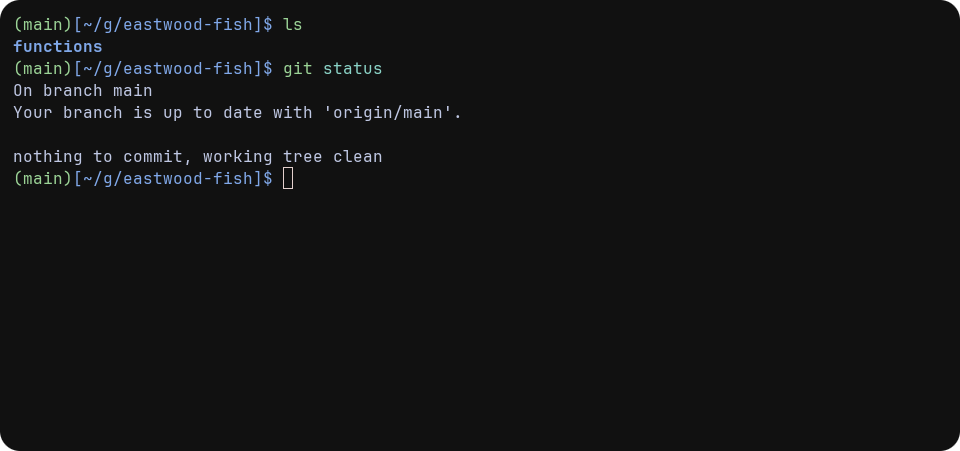

  

# Eastwood Fish Theme

**Eastwood-Fish** is a clean and ultra-minimal Fish shell theme, inspired by [Eastwood](https://github.com/ohmyzsh/ohmyzsh/blob/master/themes/eastwood.zsh-theme).

## Features

- simple

  

